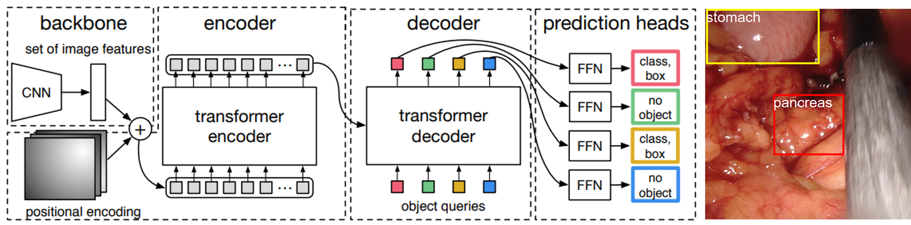

# DETR in Medical Imaging: Organ Detection in Minimally Invasive Surgery
PyTorch implementation for investigating transformer configurations in organ detection using the Detection Transformer (DETR). This project explores the application of DETR for bounding box detection of organs in laparoscopic images, leveraging a ResNet-50 backbone and transformer architecture. Various transformer configurations, including encoder-decoder depth and attention heads, were evaluated to optimize detection accuracy. Results highlight the potential of asymmetric configurations and multi-head attention for improving precision in minimally invasive surgery, offering insights for future advancements in medical computer vision.  
[Gerardo Loza](https://ai-medical.leeds.ac.uk/profiles/gerardo-loza/), 
[Pietro Valdastri](https://eps.leeds.ac.uk/electronic-engineering/staff/863/professor-pietro-valdastri)



Work done at the [STORM Lab UK](https://www.stormlabuk.com/) and the [Centre for Doctoral Training in Artificial Intelligence for Medical Diagnosis and Care](https://ai-medical.leeds.ac.uk/), University of Leeds

### Acknowledgments
This work was inspired from the paper [End-to-end object detection with Transformers](https://www.ecva.net/papers/eccv_2020/papers_ECCV/papers/123460205.pdf) and our implementation leverages some of the code provided in the [DETR github](https://github.com/facebookresearch/detr) and the [HugginFace documentation](https://huggingface.co/docs/transformers/model_doc/detr)

# Disclaimer
Several of the files within this repository are maintained from the original repository. Through development they were altered but they do not necessarily impact the functional model training and evaluation code. Furthermore, several notebooks were made for testing of different features. These also do not impact the final training and evaluation code. The important files are highlighted below.

# Installation
This code was tested with conda=23.1.0, python=3.9 and ubuntu 20.04.

```
git clone https://github.com/jayanpatel789/DTx_OrganDetection_DSAD.git
cd DTx_OrganDetection_DSAD
conda env create --file env.yml
conda activate DTx
```

# Data
The data used for this project was the Dresden Surgical Anatomy Dataset (DSAD). Download the DSAD from [here](https://springernature.figshare.com/articles/dataset/The_Dresden_Surgical_Anatomy_Dataset_for_abdominal_organ_segmentation_in_surgical_data_science/21702600?file=38494425).

The DSAD was first split into train, test and validation splits using the suggested splits in [Kolbinger et al., 2023](https://pubmed.ncbi.nlm.nih.gov/37526099/). To utilise the HuggingFace DETR, COCO annotations must be created for the DSAD, hence COCO conversion files were developed.

### Entire DSAD - Object Detection, Segmentation

- [imageManager.py](http://imageManager.py) - creates copy of DSAD folder, organised into train, test and val folders.
- [DSADtoCOCO.py](http://DSADtoCOCO.py) - creates bounding box and segmentation labels for all images in the dataset.

### Multilabel - Panoptic Segmentation

- [imageManagerMultilabel.py](http://imageManagerMultilabel.py) - creates copy of multilabel folder, organised into train, test and val folders.
- [multilabelToCOCO.py](http://multilabelToCOCO.py) - created bounding box, segmentation and panoptic segmentation masks for the multilabel folder only.

For the final project only the processed multilabel data was used, using the bounding box labels.

# Training 
With the processed input data, run the following command to start training.

```
python DETRtrain.py --model_name "test_model_name"
```
Where:
- --model_name: Name for the results folder (string, required).

The following parameters can be used at the command line to alter the model configuration:
- --qs: Number of object queries (default: 100, integer).
- --backbone: Backbone type, use 50 for ResNet-50 or 101 for ResNet-101 (default: 50, integer).
- --TxELs: Number of Transformer encoder layers (default: 6, integer).
- --TxDLs: Number of Transformer decoder layers (default: 6, integer).
- --TxAHs: Number of Transformer attention heads (default: 8, integer).
- --augment: Use data augmentation (True or False, default: False, string).
- --freeze: Freeze specific parts of the model; options are CNN or Tx (default: None, string).

# Evaluation 
Insert the name of the model name into the model_name parameter and ensure that the model config parameters equal the parameters of the trained model being tested.

```
python eval.py -model_name "test_model_name"
```
These parameters should be correct for successful model initialisation.
- --qs: Number of object queries (default: 100, integer).
- --backbone: Backbone type, use 50 for ResNet-50 or 101 for ResNet-101 (default: 50, integer).
- --TxELs: Number of Transformer encoder layers (default: 6, integer).
- --TxDLs: Number of Transformer decoder layers (default: 6, integer).
- --TxAHs: Number of Transformer attention heads (default: 8, integer).

Other optional parameters that can be used are as follows:
- --remove: Remove specific model components; options are CNN or Tx (default: None, string).
- --freeze: Freeze specific parts of the model; options are CNN or Tx (default: None, string).
- --untrained: Use an untrained model (0 for pretrained, 1 for untrained, default: 0, integer).

# Citation
This is the citation for the original repo that was forked.
```bibtex
@article{Loza2023DTx,
   author = {Gerardo Loza and Pietro Valdastri and Sharib Ali},
   doi = {10.1049/HTL2.12060},
   issn = {2053-3713},
   journal = {Healthcare Technology Letters},
   keywords = {computer vision,medical image processing,object detection,surgery},
   publisher = {The Institution of Engineering and Technology},
   title = {Real-time surgical tool detection with multi-scale positional encoding and contrastive learning},
   url = {https://onlinelibrary.wiley.com/doi/full/10.1049/htl2.12060 https://onlinelibrary.wiley.com/doi/abs/10.1049/htl2.12060 https://ietresearch.onlinelibrary.wiley.com/doi/10.1049/htl2.12060},
   year = {2023},
}
```

